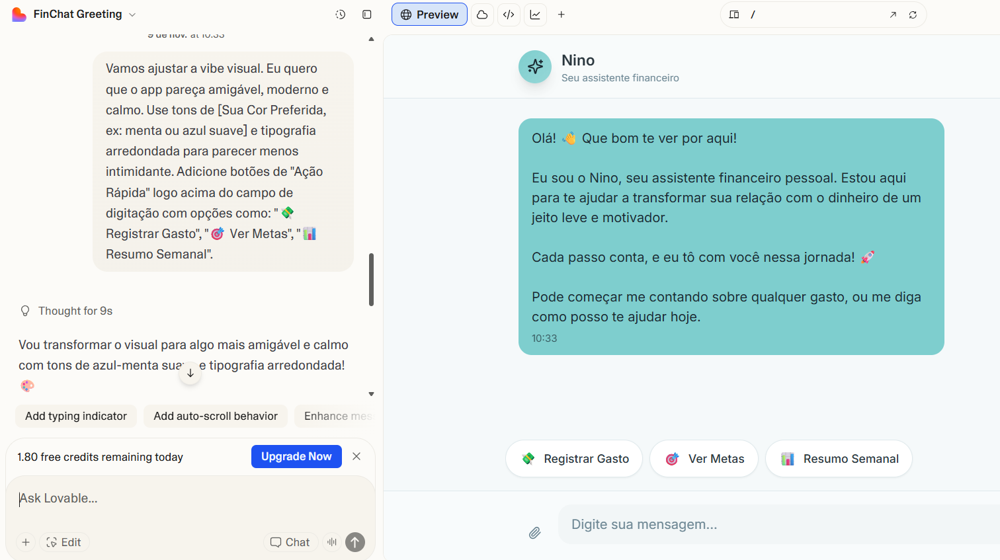

# 💸 Finchat - AI Personal Finance Assistant
> *Um conceito de aplicativo desenvolvido via Vibe Coding (IA-First)*

  
  
  

## 📋 Sobre o Projeto

Este repositório não contém apenas código; ele documenta o processo de **Vibe Coding** utilizado para conceber um aplicativo de finanças pessoais inovador.

O objetivo foi atuar como "Tech Lead" de ferramentas de IA (Copilot, Lovable), guiando-as através de prompts intencionais para gerar uma solução completa — desde o conceito até a validação técnica — sem escrever manualmente cada linha de código.

---

## ✨ O que é Vibe Coding?

> **Vibe Coding** é programar com foco na intenção e no contexto, não apenas na sintaxe.

É a arte de traduzir uma ideia (a "vibe") em um produto funcional através de conversas estruturadas com IAs. Em vez de quebrar a cabeça com a implementação detalhada, você gerencia a IA para que ela construa a solução baseada na sua visão estratégica.

---

## 🎯 O Desafio

| Problema 😫 | Solução Proposta 💡 |
| :--- | :--- |
| Apps financeiros tradicionais são chatos, exigem muita entrada manual e falham em manter o usuário engajado a longo prazo. | Um **Assistente Financeiro via Chat**. O usuário conversa naturalmente ("Gastei 50 reais em pizza"), e a IA classifica, registra e dá dicas personalizadas em tempo real. |

---

## 🧩 Processo de Criação

O desenvolvimento seguiu um fluxo estruturado para garantir que a IA entendesse perfeitamente a "vibe" do produto.

### 1. Definição de Intenção (PRD)
Criação de um *Product Requirements Document* simplificado para servir como "super prompt" inicial.
> 📄 **Ver documento:** [`docs/prompt-final.md`](docs/prompt-final.md)

### 2. Vibe Check & Ideação com IA
Utilização de IA (Copilot/ChatGPT) para refinar a ideia:
- Definição da persona do "Agente Financeiro" (amigável, sem jargões).
- Brainstorming de funcionalidades-chave.

### 3. Prototipação Conceitual
Geração de fluxos de usuário e wireframes de baixa fidelidade via prompts.
> 📐 **Ver fluxo:** [`docs/fluxo-telas.md`](docs/fluxo-telas.md)

### 4. Planejamento Técnico (MVP)
Solicitação à IA para definir a stack tecnológica e o plano de validação mais enxuto possível.
> 🚀 **Ver plano:** [`docs/mvp-plano.md`](docs/mvp-plano.md)

---

## 🔑 Funcionalidades-Chave do Conceito

- [x] **Registro via Chat Natural:** "Paguei a conta de luz, R$150" → *Registrado automaticamente em 'Contas Essenciais'.*
- [x] **Agente Proativo:** O app manda mensagens como: "Vi que você gastou menos com delivery essa semana. Que tal guardar essa diferença?"
- [x] **Metas Inteligentes:** Criação de objetivos de economia baseados no histórico de gastos real do usuário.
- [x] **Relatórios Conversacionais:** Em vez de gráficos complexos, resumos em texto simples: "Este mês você gastou 10% a mais em lazer do que no mês passado."

---

## 📸 Galeria de Interações

*Exemplos reais do processo de "conversa" com a IA para gerar este projeto.*

  
  
  
<em>Fig 1: Refinando o tom de voz do agente | Fig 2: Gerando o fluxo de telas</em>

---

## 💭 Reflexão Final

Este desafio demonstrou que a barreira de entrada para criar produtos digitais complexos diminuiu drasticamente.

* **O que funcionou:** A estruturação prévia do PRD (o "briefing") fez com que a IA gerasse resultados incrivelmente alinhados na primeira tentativa.
* **Aprendizado chave:** A qualidade do output da IA é diretamente proporcional à clareza da sua intenção. Vibe Coding não é sobre pedir "crie um app", mas sobre saber *como* pedir.

---

  Desenvolvido com 🧠 e 🤖 por <strong>Marcus Vasconcellos</strong>

